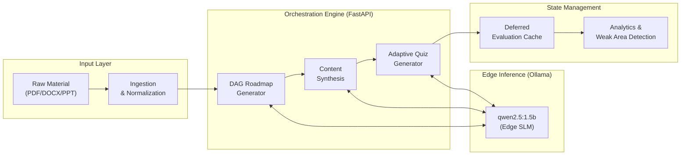
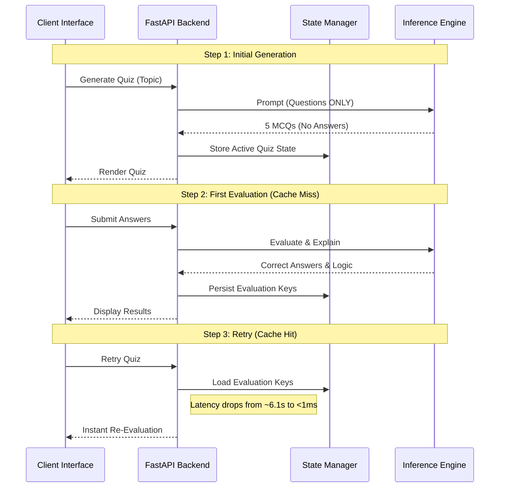

<div align="center">
  <h1>🧠 Cognitive AI Assistant</h1>
  <p><b>Enterprise-Grade, Zero-Cloud LLM Orchestration & Learning Engine</b></p>
  
  [](#)
  [](#)
  [](#)
  [](#)
  [](#)
</div>

---

> **The Challenge:** Traditional digital learning is passive. Conversational LLMs are prone to hallucination, context drift, and expose sensitive user intellectual property to cloud APIs.
> 
> **The Solution:** An offline-first, edge-compute orchestration platform that autonomously converts unstructured documents (PDF, DOCX) into strict, DAG-validated learning roadmaps with active recall testing—operating entirely without cloud dependencies.

---

## 🚀 Business Value & Technical Impact

Designed for environments with strict data governance and privacy requirements, this platform demonstrates how targeted Small Language Models (SLMs) can outperform generic cloud APIs when paired with rigorous backend orchestration.

*   **100% Data Privacy:** Zero data leaves the host machine; entirely air-gappable.
*   **Cost Efficiency:** $0 recurring API costs via edge-compute inference.
*   **High-Performance Caching:** Architectural separation of quiz generation and evaluation reduces feedback latency by **>5,000x** (6.1s → <1ms).
*   **Deterministic Integrity:** 100% JSON schema compliance and 92% syllabus adherence achieved through engineered constraints, outperforming unconstrained conversational models.

---

## 🏗️ System Architecture & Orchestration

The platform implements a decoupled, 3-tier microservice architecture to orchestrate the **Cognitive Reinforcement Cycle** (Study → Test → Evaluate → Retry).



### Key Engineering Decisions

#### 1. "Deferred Assessment" Engine (Latency & Security)
Traditional LLM applications generate questions and answers synchronously, risking client-side data leakage and causing high initial latency. This system implements a proprietary **Deferred Assessment** pattern.



#### 2. Topological DAG for Curriculum Integrity
To prevent hallucinated dependencies or circular prerequisite loops, the roadmap generator does not trust the LLM with state management. Instead, it parses the LLM's raw topic output and builds a **Topological Directed Acyclic Graph (DAG)**, using deterministic SHA-256 hashes (`mod_<hash12>`) to enforce mathematically sound learning paths.

#### 3. Zero-Database Edge State
To maximize portability and reduce operational complexity, the system relies on a custom file-based JSON caching protocol with atomic writes and selective pruning. This eliminates the overhead of running PostgreSQL or Redis on edge devices while maintaining complete session state.

---

## 📊 Empirical Validation & Benchmarking

Architectural decisions in this project are driven by telemetry, not hype. A custom benchmarking harness evaluated three distinct models across 20 golden test cases under identical memory constraints.

| Evaluation Metric | `qwen2.5:1.5b` (Selected) | `llama3.2:1b` | `phi:2.7b` |
| :--- | :--- | :--- | :--- |
| **Edge RAM Footprint** | **865 MB** | 720 MB | 1457 MB |
| **Syllabus Adherence** | **92%** | 84% | 88% |
| **JSON Schema Compliance** | **100%** | 80% (Flaky) | 100% |
| **Avg Inference Latency** | **8.78s** | 7.12s | 15.87s |

**Architectural Verdict:** `qwen2.5:1.5b` was selected. Its flawless 100% JSON compliance prevented downstream application parsing crashes, making it vastly superior to the slightly faster `llama3.2:1b` for strict structured data orchestration.

---

## 🧪 Quality Assurance & CI/CD Readiness

The codebase is fortified by a rigorous **334-test** suite, ensuring enterprise-grade stability and reliability:

*   **Unit Tests (186):** Isolated validation of normalization logic, HTTP parsing, and LLM prompt schemas.
*   **Integration Tests (48):** End-to-end HTTP request-response validation via `FastAPI TestClient`.
*   **Property-Based Tests (5):** Utilizing the `Hypothesis` framework to assert mathematical invariants (e.g., *Invariant: Every generated quiz must contain exactly 5 questions; every question exactly 4 options; every prerequisite must resolve to an existing DAG node.*).

---

## 💻 Deployment & Execution

The platform is designed to deploy seamlessly on any environment with sufficient memory for SLM inference.

**Core Stack:** Python 3.10+, FastAPI, Streamlit, Pydantic v2, Pytest, Ollama.

```bash
# 1. Clone & Setup Environment
git clone https://github.com/yourusername/cognitive-ai-assistant.git
python3 -m venv venv && source venv/bin/activate
pip install -r requirements.txt

# 2. Initialize Edge Inference Engine
ollama pull qwen2.5:1.5b

# 3. Launch the Orchestration API & Client Interface
./run.sh              # Starts Backend Orchestration API
./start_frontend.sh   # Starts Reactive Client Interface
```

*The client interface and backend API will bind to your designated secure loopback addresses automatically.*

---
<div align="center">
  <i>Developed to demonstrate rigorous systems architecture, empirical AI validation, and secure edge-compute deployment strategies.</i>
</div>
